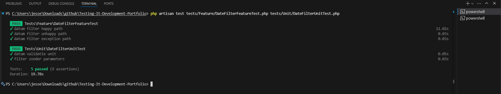
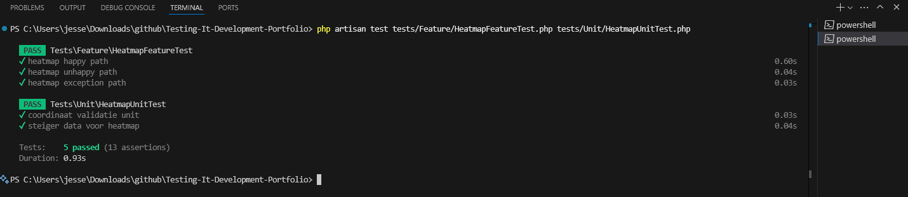

# Ligplaats Bezetting Dashboard - Testing Portfolio

## Testplan

### 1. Inleiding

Voor dit testplan ga ik twee user stories van ons Rijkswaterstaat dashboard testen volgens het V-model. Dit dashboard geeft inzicht in ligplaats bezetting, dus het moet data over de ligging van binnenvaartsschepen inzichtelijk maken. Een adviseur van rijkswaterstaat gaat van dit dashboard gebruik maken.

We hebben wel een grote dataset van meer dan 230.000 rijen, maar dat is veel te groot om mee te testen. Het laden duurt lang en maakt alles traag. Daarom maak ik factories om kleine testjes te genereren die snel uitgevoerd kunnen worden.

### 2. Het V-model

Het V-model zorgt ervoor dat je bij elke ontwikkelingsstap ook nadenkt over hoe je het gaat testen:

```
User Story (Requirements) ←→ System Tests (test de hele user story)
        ↓                           ↑
Function Design ←→ Integration Tests (als dit nodig is)
        ↓                           ↑
Code Implementation ←→ Unit Tests (test losse functies)
```

Voor mijn twee user stories betekent dit dat ik system tests maak die de hele route volgens de acceptance criteria testen, en unit tests voor de individuele functies.

### 3. User Stories

#### User Story 2: Filteren op Datumbereik

**Elicitation:**
Uit ons gesprek met de opdrachtgever is duidelijk geworden dat hij graag wil kunnen filteren op datum.

**Initial User Story:**
Als adviseur bij Rijkswaterstaat moet ik een begin- en einddatum kunnen selecteren, om zo goed de scope te kunnen definiëren en verschillen over tijd te kunnen laten zien.

**Validation:**
De opdrachtgever heeft in het gesprek op 1 april 2025 deze userstory zonder commentaar goedgekeurd.

**Revised User Story:**
Geen veranderingen

**Acceptance Criteria:**

**Main Flow:**
- **Given:** de Rijkswaterstaatadviseur is op het dashboard
- **When:** hij een begin- en/of einddatum selecteert, mogelijk met een datumslicer
- **Then:** krijgt hij de data binnen dat deel van tijd te zien

**Alternative Flow:**
- **Given:** de Rijkswaterstaatadviseur is op het dashboard
- **When:** hij een begin- en/of einddatum selecteert
- **And:** er valt geen data binnen het geselecteerde datumbereik
- **Then:** krijgt hij een bericht te zien waarin staat dat er geen data binnen het geselecteerde datumbereik valt

**Exception Flow:**
- **Given:** de Rijkswaterstaatadviseur is op het dashboard
- **When:** hij een begin- en/of einddatum selecteert
- **And:** de begindatum is later dan de einddatum
- **Then:** krijgt hij een bericht te zien met een errormelding

**V-model koppeling:**
- **System Tests:** Test de complete flow van datum invullen tot resultaat zien
- **Unit Tests:** Test losse functies zoals datumvalidatie en het filteren zelf

**System Tests:**

**Test 1: Happy path - normale datum selectie (Main Flow)**
- **Given:** Er zijn events in maart 2024 en januari 2024
- **When:** Ik filter op maart 2024 
- **Then:** Alleen de maart events worden getoond
- **Waarom:** Dit is de hoofdfunctionaliteit

**Test 2: Unhappy path - geen data (Alternative Flow)**
- **Given:** Er zijn alleen events in januari 2024
- **When:** Ik filter op maart 2024 (waar geen data is)
- **Then:** 0 events worden getoond
- **Waarom:** Gebruiker moet zien dat er geen data is

**Test 3: Exception path - verkeerde volgorde (Exception Flow)**
- **Given:** Er zijn events beschikbaar
- **When:** Ik gebruik startDate na endDate (verkeerd om)
- **Then:** 0 events worden getoond
- **Waarom:** Voorkomt verwarring

**Unit Tests:**
- Test `applyDateFilter` functie met verschillende parameters
- Test wat er gebeurt zonder filter parameters
- **Waarom:** Deze functies zijn de kern van het filteren

**Wat ik niet test:** Performance met grote datasets, UI styling, browser compatibiliteit - dat valt buiten scope.

#### User Story 15: Geografische Kaart

**Elicitation:**
Uit gesprek met de opdrachtgever is gebleken dat hij wil zien hoe druk het was bij welk object, welke haven of welke paal. Liefst met een kaartje waarop cirkels staan, waar de grootte overeenkomt met statistieken.

**Initial User Story:**
Als een adviseur bij Rijkswaterstaat heb ik een kaart nodig met een overzicht van waar het hoe druk is, zodat ik goede adviezen kan geven over ligplaatsen.

**Validation:**
De opdrachtgever heeft in het gesprek op 1 april 2025 deze userstory goedgekeurd, maar vond wel dat het iets verduidelijkt kon worden.

**Revised User Story:**
Als een adviseur bij Rijkswaterstaat wil ik een kaart zien van de Zuidwestelijke delta met daarop, per object, wachthaven of steiger, een cirkel waarvan de grootte de waarde van een bepaalde statistiek weergeeft, bijvoorbeeld de hoeveelheid evenementen of de gemiddelde duur, zodat ik goed inzicht krijg in deze statistieken om daarmee goede adviezen te geven.

**Acceptance Criteria:**

**Main Flow:**
- **Given:** de adviseur is op het dashboard
- **When:** hij een level van detail selecteert
- **Then:** krijgt hij een kaart te zien, met daarop cirkels per geselecteerd level detail

**Alternative Flow:**
- **Given:** de adviseur is op het dashboard
- **When:** hij selecteert *per steiger*
- **Then:** krijgt hij iets te zien waarbij hij een object of wachthaven kan selecteren
- **When:** hij selecteert een wachthaven
- **Then:** krijgt hij een kaart te zien van steigers van de wachthaven en de bezetting daarvan, zonder dat alle steigers van andere wachthavens worden getoond

**Exception Flow:**
- **Given:** De adviseur is op het dashboard
- **When:** hij een detail-level selecteert en er een error plaatsvindt
- **Then:** krijgt hij een errorbericht te zien

**V-model koppeling:**
- **System Tests:** Test of de kaart goed wordt weergegeven met de juiste data
- **Unit Tests:** Test functies voor coördinaten en data ophalen

**System Tests:**

**Test 1: Happy path - kaart met locaties (Main Flow)**
- **Given:** Er zijn steigers met coördinaten
- **When:** Ik ga naar de heatmap pagina
- **Then:** Pagina laadt en er zijn steigers beschikbaar
- **Waarom:** Hoofdfunctionaliteit van de heatmap

**Test 2: Unhappy path - geen data (Alternative Flow)**
- **Given:** Er zijn geen steigers in de database
- **When:** Ik ga naar de heatmap pagina
- **Then:** Pagina laadt maar geen steigers beschikbaar
- **Waarom:** Gebruiker moet zien dat er geen data is

**Test 3: Exception path - ongeldige coördinaten (Exception Flow)**
- **Given:** Er zijn steigers met en zonder coördinaten
- **When:** Ik ga naar de heatmap pagina
- **Then:** Alleen steigers met geldige coördinaten zijn beschikbaar
- **Waarom:** Voorkomt errors

**Unit Tests:**
- Test coördinaat validatie (NULL vs geldige waarden)
- Test database queries voor steigers met coördinaten
- **Waarom:** Verkeerde coördinaten zorgen voor problemen

**Wat ik niet test:** Echte kaart rendering (doet de library), zoom/pan functionaliteit, styling - dat valt buiten scope.

### 4. Test Data

Ik gebruik factories om kleine testjes te maken:

```php
// Events in verschillende maanden
Evenement::factory()->count(3)->create([
    'evenement_begin_datum' => '2024-03-15 10:00:00'
]);

// Steigers met/zonder coördinaten
Steiger::factory()->create([
    'latitude' => 51.5074,
    'longitude' => 4.3120
]);
```

### 5. CI/CD Automatisering

GitHub Actions draait automatisch alle tests bij elke push:

```yaml
- name: Run my specific tests
  run: |
    php artisan test tests/Feature/DateFilterFeatureTest.php
    php artisan test tests/Unit/DateFilterUnitTest.php
    php artisan test tests/Feature/HeatmapFeatureTest.php
    php artisan test tests/Unit/HeatmapUnitTest.php
```

## Screenshots van Testresultaten

### Datumfilter Tests




### Heatmap Tests




**Totaal: 10 van 10 tests passed**

---

## Evaluatie

### Reflectie op tests en proces

Ik vind dat het testproces goed is verlopen. Door factories te gebruiken kon ik binnen een paar seconden werken of mijn features nog werkte en hoefde ik niet te werken met een onhandige dataset van 230000 rijen. Het V-model heeft me geholpen om duidelijk te maken wat ik moest testen. Nu weet ik dat ik system tests kan doen om te checken of alles samen werkt, en unit tests voor individuele stukjes code.

### Opdrachtvragen

#### 1. Mogelijke fout die WEL kan worden aangetoond

**Datumfilter:** Als de `applyDateFilter` functie per ongeluk `>` gebruikt in plaats van `>=`, dan wordt een event op exact de startdatum uitgesloten. Dit ontdekt mijn unit test die controleert of events op 1 maart wel worden meegenomen.

**Heatmap:** Als de database query `latitude IS NULL` gebruikt in plaats van `IS NOT NULL`, dan worden alleen steigers zonder coördinaten opgehaald. Dit ontdekt mijn unit test die controleert hoeveel steigers worden gevonden.

#### 2. Mogelijke fout die NIET kan worden aangetoond

**Performance:** De tests gebruiken kleine datasets (3-5 records). Als de queries met de volledige database van 230.000+ records te lang duren, zien mijn tests dit niet

**UI/UX:** We testen niet of gebruikers de datumfilter intuitief vinden, of de kaart op de juiste locatie opent.

**Browser bugs:** Tests draaien alleen in test environment, niet in echte browsers waar JavaScript soms nog errors kan hebben.

#### 3. In hoeverre kan ik concluderen "of alles het goed doet"?

**Wat ik zeker weet:**
De technische functies werken goed - datumfiltering geeft de juiste resultaten, de heatmap laadt correct, en foute input wordt netjes verwerkt met errors.

**Wat ik nog niet weet:**
Of het snel genoeg is met veel data, of gebruikers het fijn en logisch vinden om te gebruiken.

**Conclusie:**
Ik ben er bijna zeker van dat de basis functionaliteit klopt. Maar om helemaal zeker te zijn zou ik ook moeten testen hoe het presteert met de volledige database en of het praktisch bruikbaar is voor Rijkswaterstaat adviseurs.


### Verbetervoorstel

**Probleem:** Het testplan test vooral of het technisch werkt, maar niet of het dashboard praktisch fijn is om te gebruiken.

**Voorstel:** Een test doen met de Rijkswaterstaat adviseur:
- Kan hij snel de informatie vinden die hij nodig heeft?
- Is de datumfilter intuïtief genoeg?
- Toont de heatmap ook echt de dingen die hij willen kunnen inzien?

Dit zou er voor zorgen dat ik er 100% zeker van ben dat de features kloppend zijn en dat de klant tevreden is. Dan test ik namelijk niet alleen de code, maar ook de gebruiksvriendelijkheid.

---
